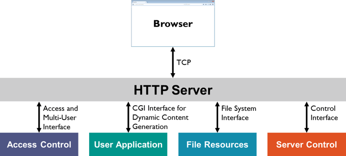

# web_pyapplication

  

<h1>Програма для обробки повідомлень</h1>

Ця програма демонструє використання HTTP та Socket серверів для обробки повідомлень веб-форми і передачі їх до Socket сервера для збереження у файлі.

<h2>Встановлення</h2>

Клонуйте цей репозиторій до свого локального середовища:

    git clone https://github.com/VAlduinV/web_pyapplication.git

<h2>Перейдіть до директорії проекту:</h2>
    
    cd your_repository

<h2>Запустіть програму за допомогою Python:</h2>
    
    python web_app.py

<h2>Використання</h2>
    
Після запуску програми ви зможете отримати доступ до веб-інтерфейсу за адресою <a href="http://localhost:3000">http://localhost:3000</a> у вашому веб-браузері.

    
Головна сторінка (<a href="http://localhost:3000">http://localhost:3000</a>) містить посилання на сторінку з формою, де ви можете ввести своє ім'я та повідомлення.

    
Після заповнення форми і відправки повідомлення, дані будуть передані на сервер і збережені у файлі storage/data.json.

    
Ви також можете отримати доступ до статичних файлів, таких як style.css та logo.png, за допомогою відповідних шляхів (<a href="http://localhost:3000/style.css">http://localhost:3000/style.css </a> та <a href="http://localhost:3000/logo.png">http://localhost:3000/logo.png </a>).

<h2>Залежності</h2>
    
Ця програма використовує деякі залежності Python, які потрібно встановити перед її використанням. Встановіть ці залежності, використовуючи pip, за допомогою наступної команди:

    pip install -r requirements.txt

